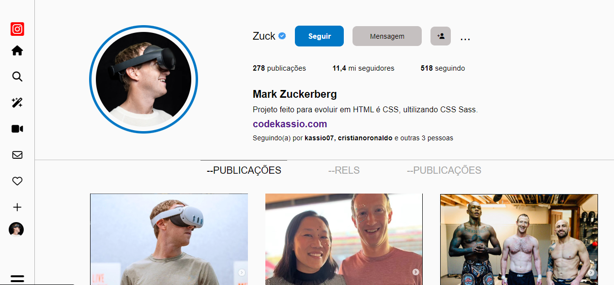

# clone do instagram 
 clone do instagram do Mark Zuckerberg
 projeto feito com html css, css sass
 
 <h2 align="center">Programador Front-End</h2>
 #<a href="https://kaesssantos.github.io/clone-do-instagram/">Projeto</a>
 

    
 

 ## 🚀 Tecnologias

 Esse projeto foi desenvolvido com as seguindes tecnologias:

 - HTML e CSS 
 - Sass
 - GitHub
 - Visual Studio Code

 ## 💻 Projeto

 Fiz esse projeto com o intuito de expandir minhas habilidades com as tecnologias citadas acima.

 ## :memo: Licença 

 Esse projeto está sobre a licença MIT.

